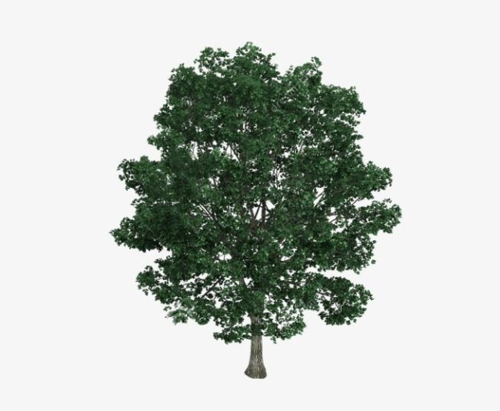

# prac_class

Surround words with an underscore(_) to make it _italics_
Surround words with two asterisks(**) to make it __bold__

Preface the phrase with a hash mark(#) to make headers
# header1
## header2
### header3
#### header4
##### header5
###### header6

